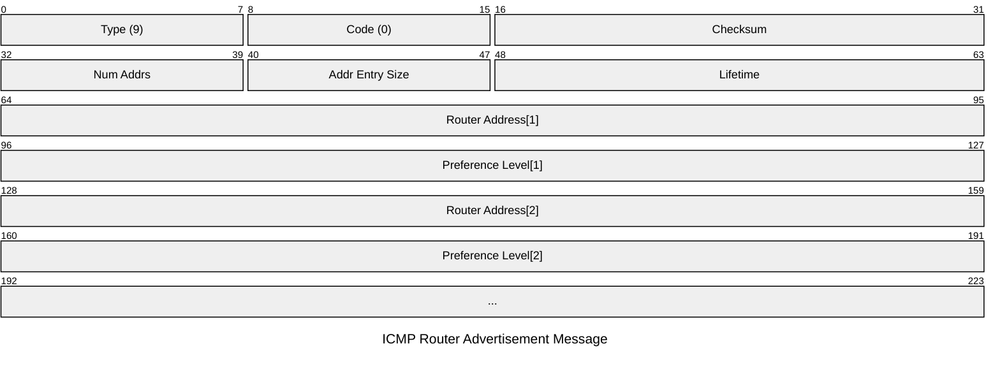
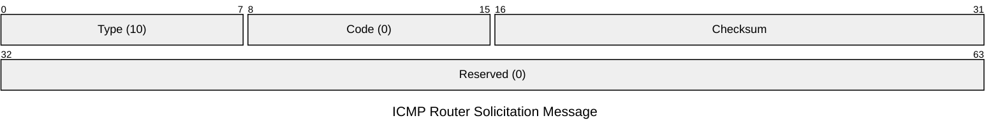

ICMP(Internet Control Message Protocol)는 host와 router간의 핸들링 에러 혹은 컨트롤에 의한 정보를 주고 받기 위하여 만들어진 프로토컬 이다.

```c
typedef struct icmp_header icmphdr_t;

struct icmp_header
{
    unsigned char icmp_type; /* type of message, see below */
    unsigned char icmp_code; /* type sub code */
    unsigned short icmp_cksum; /* ones complement cksum of struct */
    union
    {
        unsigned char ih_pptr; /* ICMP_PARAMPROB */
        
        struct in_addr ih_gwaddr; /* ICMP_REDIRECT */
        struct ih_idseq
        {
            unsigned short icd_id;
            unsigned short icd_seq;
        } ih_idseq;
        int ih_void;

        /* ICMP_UNREACH_NEEDFRAG -- Path MTU discovery as per rfc 1191 */
        struct ih_pmtu
        {
            unsigned short ipm_void;
            unsigned short ipm_nextmtu;
        } ih_pmtu;
/* ICMP_ROUTERADV -- RFC 1256 */
        struct ih_rtradv
        {
            unsigned char irt_num_addrs; /* Number of addresses following the msg */
            unsigned char irt_wpa; /* Address Entry Size (32-bit words) */
            unsigned short irt_lifetime; /* Lifetime */
        } ih_rtradv;
    } icmp_hun;
    union
    {
    struct id_ts /* ICMP_TIMESTAMP, ICMP_TIMESTAMPREPLY */
    {
        n_time its_otime; /* Originate timestamp */
        n_time its_rtime; /* Recieve timestamp */
        n_time its_ttime; /* Transmit timestamp */
    } id_ts;
    struct id_ip /* Original IP header */
    {
        struct ip idi_ip;
        /* options and then 64 bits of data */
    } id_ip;
    unsigned long id_mask; /* ICMP_ADDRESS, ICMP_ADDRESSREPLY */
    char id_data[1];
    } icmp_dun;
};
```

## RFC 1256

RFC 1256을 참고하면 시간적 타임아웃을 이용하여 네트워크 속 switch와 router중 빠른 경로를 찾아간다는 것을 볼 수 있다.

## ICMP Message Format

###  Advertisement

ICMP의 라우터에서의 해당 IP에 대한 설명을 작성해둔 massage 틀이다.
이는 router에 연결되있는 모든 곳에 전파하여 그 기기들도 해당하는 ip가 얼마나 걸리는 시간에 있는지 기록할 수 있다. 또한 그럼으로 시간을 계산하여 보다 빠른 길을 선택하도록 유도 할 수 있게 된다.



패킷에 대한 설명

|**필드명**|**값/크기**|**설명**|
|---|---|---|
|**Type**|**9**|Router Advertisement를 나타내는 고유 타입 번호|
|**Code**|**0**|기본 코드 값|
|**Checksum**|16-bit|ICMP 메시지 전체(Type부터 끝까지)의 오류 검출용 합계|
|**Num Addrs**|8-bit|이 메시지에 포함된 라우터 주소의 개수|
|**Addr Entry Size**|8-bit|주소당 32비트 워드 수 (현재 프로토콜 버전에서는 **2**)|
|**Lifetime**|16-bit|광고된 주소가 유효하다고 간주되는 최대 시간(**초** 단위)|
|**Router Address[i]**|32-bit|전송 라우터의 해당 인터페이스 IP 주소|
|**Preference Level[i]**|32-bit|해당 주소의 선호도 (높을수록 우선순위가 높음, 2의 보수 형식)|


ICMP의 특성이 시간을 이용한 확인을 하기때문에 실제 전송에 대한 응답을 기다리는 시간을 설정할 수도 있고 이에 따라 시간을 높이는 것으로 좀더 연결이 힘든 구간까지 시간 오버되어도 확인 할 수 있도록 설정 하여 보낼 수있다.


이는 다음 변수로 인해 설정이 가능하고 

|**매개변수명**|**설명**|**허용 범위 / 조건**|**기본값 (Default)**|
|---|---|---|---|
|**AdvertisementAddress**|광고를 보낼 목적지 IP 주소|`224.0.0.1` (권장) 또는 `255.255.255.255`|멀티캐스트 지원 시 `224.0.0.1`|
|**MaxAdvertisementInterval**|광고 전송 간 최대 시간 간격|4초 ~ 1800초|600초 (10분)|
|**MinAdvertisementInterval**|광고 전송 간 최소 시간 간격|3초 ~ `MaxInterval` 사이|`0.75 * MaxInterval`|
|**AdvertisementLifetime**|광고된 주소의 유효 기간 (ICMP Lifetime 필드값)|`MaxInterval` ~ 9000초|`3 * MaxInterval`|


### Solicitation

이는 해당 하는 IP가 있는지 요청하여 있으면 답을 받는 요청 message이다.



|**필드명**|**값/크기**|**설명**|
|---|---|---|
|**Type**|**10**|Router Solicitation을 나타내는 고유 타입 번호|
|**Code**|**0**|기본 코드 값|
|**Checksum**|16-bit|ICMP 메시지 전체에 대한 오류 검출용 합계|
|**Reserved**|32-bit|예약된 영역. 보낼 때는 **0**으로 채워 보내며, 받을 때는 무시함|

이러한 방법으로 홍보? 되지 않은 IP도 물어보면서 찾아 답을 받을 수 있게 되는 것이다.

## Reference

- RFC 1256